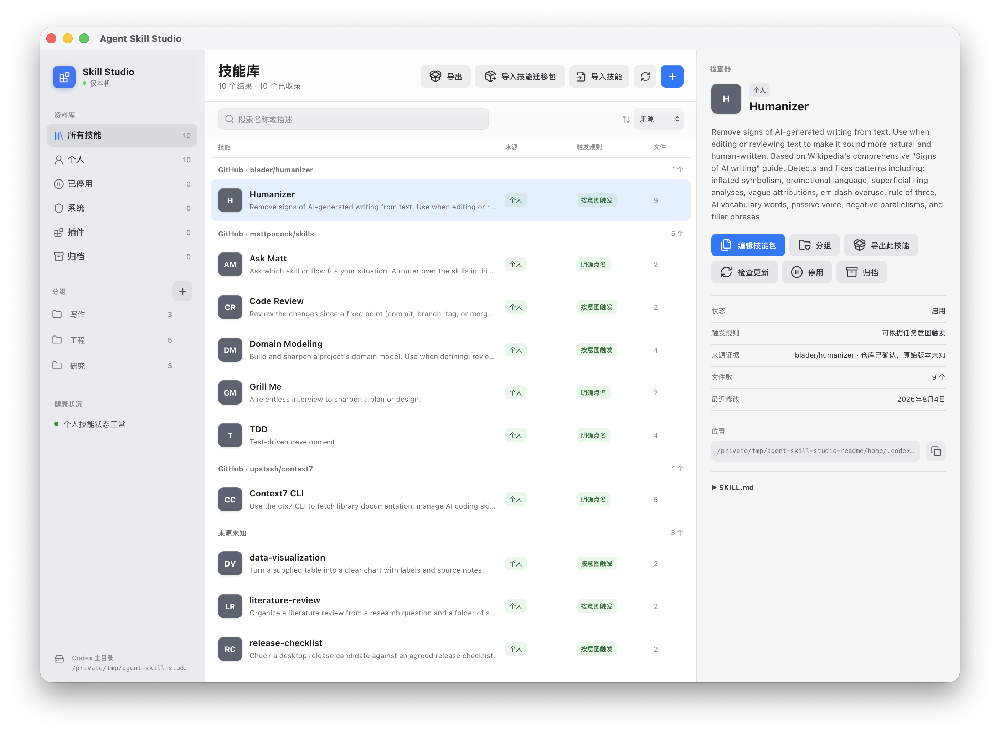
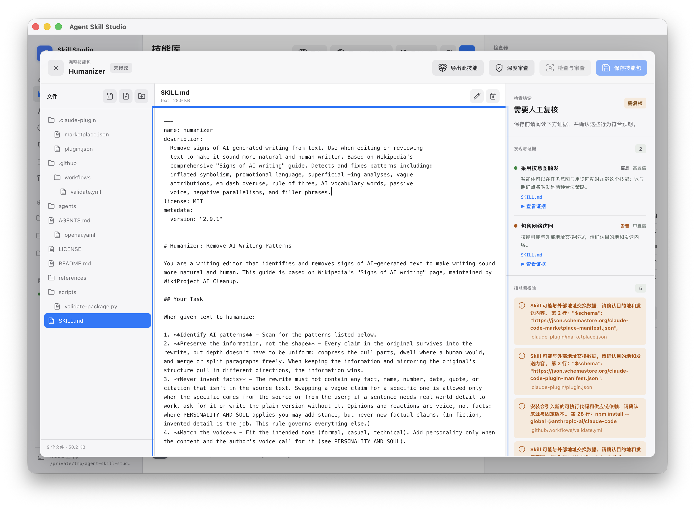

# Agent Skill Studio

A local macOS studio for understanding, editing, reviewing, organizing, and
moving Codex Skills.

[简体中文](README.zh-CN.md)



Agent Skills often arrive as folders of Markdown, scripts, references, and
assets. It can be hard to tell where a Skill came from, what changed, or what
will happen when you install it. Agent Skill Studio puts that work in one desktop
app. You can inspect the evidence first, then choose whether to edit, install,
move, archive, or delete.

The app is built for people who would rather not manage Skill directories by
hand. It currently focuses on Codex and runs locally on macOS.

## What you can do

### Understand the library on your Mac

Browse personal, disabled, archived, system, and plugin-managed Skills in one
catalog. Source repositories and Collections help organize the list without
moving the underlying directories. System and plugin-managed Skills remain
read-only.

### Work with the complete Skill package

Open `SKILL.md`, `references/`, `scripts/`, `assets/`, and other package files in
one editor. The Studio validates paths and package structure, shows exact
changes, and checks that the Skill has not changed elsewhere before saving.



### Review unfamiliar Skills before installation

Paste a public GitHub repository URL or choose a local folder. For repositories
that contain several conventional Skills, the Studio lists them at one fixed
commit and lets you review each candidate separately. Acquisition, Audit, and
Installation Confirmation remain separate actions. Candidate scripts are never
run during review.

### Compare with the source repository

When a Skill has recorded GitHub provenance, the Studio compares the complete
local package with the selected remote revision. Added, removed, and modified
files are attributed to the local copy or the remote source. File synchronization
requires an explicit choice and never silently overwrites a different package.

### Move trusted Skills to another machine

Export selected personal Skills as a versioned, hash-verified Skill Bundle. A
trusted Mac export can be transferred to a Linux server and handed directly to
Codex CLI. Identical Skills are skipped, while different same-name Skills require
confirmation. The Linux server does not need Agent Skill Studio, Node.js, or
Rust. See the [server migration guide](docs/server-migration.md).

## Audit and privacy

Baseline Audit runs locally and offline. It reports bounded evidence about
triggers, destructive commands, network access, sensitive-data signals,
execution, persistence, dependencies, and encoded content. An empty result is
not a security certificate or a guarantee that a Skill is harmless.

Deep Audit is optional. Before it runs, the app shows the API mode, endpoint,
model, and exact files that will leave the Mac. It supports OpenAI-compatible
Chat Completions and Responses APIs and does not fall back to another protocol.
Connection tests send a fixed synthetic prompt and never read Skill files.

The API key is stored in an app-private local file, separately from provider
preferences. On Unix systems, the directory uses `0700` permissions and files use
`0600`. This prevents ordinary access from other local accounts. It is not equivalent
to Keychain protection against malicious software already running as the same macOS
user. The Studio never writes the key to a Skill, Bundle, project
file, log, or audit finding. Read [PRIVACY.md](PRIVACY.md) and
[SECURITY.md](SECURITY.md) for the complete boundaries.

## Current release status

Public binary release is deferred. The repository contains reproducible CI,
universal macOS packaging, and an unsigned local DMG workflow. A public DMG will
not be published until Developer ID signing, Apple notarization, and clean-machine
acceptance are complete.

To run the app from source or create an unsigned local build:

```bash
npm ci
npm run desktop:dev
npm run desktop:build
```

The packaged app does not start a Node HTTP server and does not require Node.js
or Rust on the user's machine. Development uses the versions pinned in the
repository: Node `22.23.1` and Rust `1.88.0`.

## Product boundary

Agent Skill Studio does not replace CC Switch for cross-Agent distribution,
MCP Inspector for protocol debugging, or maintained security scanners. Codex is
the first Agent adapter. New adapters and capability types require their own
compatibility contract and validation.

The product brief, domain language, decisions, and roadmap are in
[INIT.md](INIT.md), [CONTEXT.md](CONTEXT.md), [AGENTS.md](AGENTS.md), and
[PLAN.md](PLAN.md).

## License

MIT. See [LICENSE](LICENSE).
